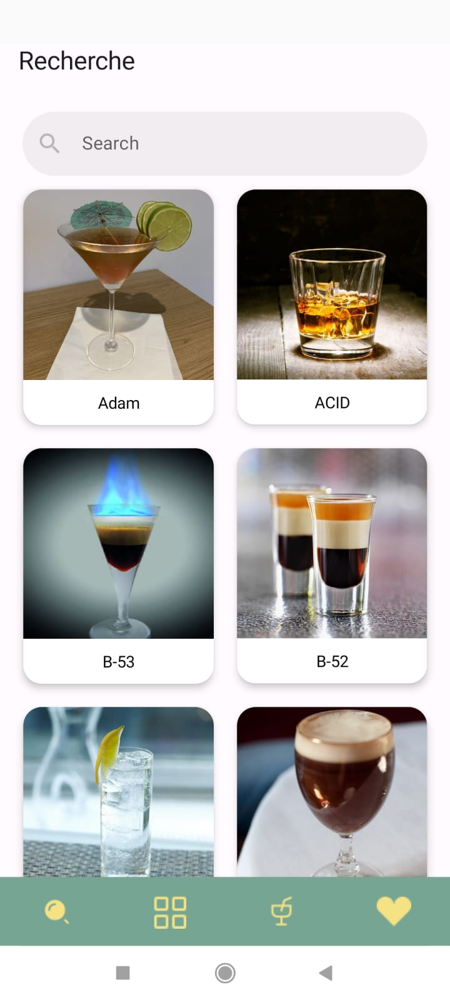
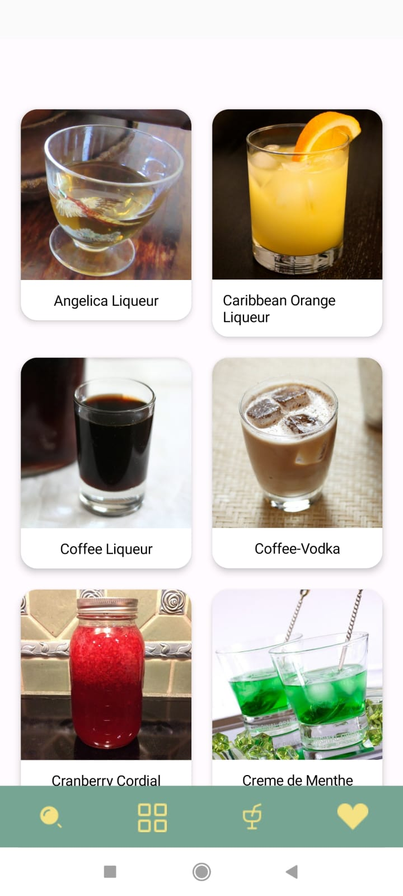

# Projet : Application de cocktails
___

Nous avons développé une application Android permettant aux utilisateurs de consulter une liste de cocktails, accompagnée de leurs différents ingrédients et catégories. Grâce à l'utilisation d'une API publique et gratuite, nous offrons la possibilité de rechercher les cocktails par leur nom et de visualiser les détails de chaque boisson.

Nous avons utilisé le kit d'outils *Jetpack Compose* en appelant des fonctions modulables pour définir nos éléments. Nous avons intégré nos composants JetPack dans notre architecture MVC pour bénéficier d'une séparation claire entre la logique métier et l'interface utilisateur (*Voir Difficultés Rencontrées), ainsi qu'une meilleure gestion du cycle de vie.

Nous avons utilisé *Figma* pour la création de nos interfaces avant de passer au développement du code.
## Membres du groupe :

___
Cette application est réalisé par le binome :
- OUMAACHA Anouar
- SAFI Hiba

## Screens et logo de l'application:
- Screen des cocktails
  - Via Recherche
  
  

  - Via Catégorie "CategoryHomede Liqueur"

  

    
  - Via Ingrédient "Amaretto"

  

- Rechercher un cocktail

  

- Screen des catégories

  

- Screen des ingrédients

  

- Screen de détails du cocktail

  

- Screen du Splash Screen

  

- Screen du Loader

  

## Fonctionnalités développées:

- La visualisation des différents cocktails
- L'affichage des diiférentes catégories
- L'affichage des différents ingrédients
- La visualisation des cocktails associés à chaque catégorie
- L'affichage des cocktails associés à chaque ingrédient
- La recherche des cocktails
- Le passage aux détails de chaque cocktail :

    - Nom du coktail
    - La catégorie
    - Le type du verre
    - Les instructions
    - Les ingrédients et leurs mesures

- L'ajout des cocktails aux favoris ( Problème d'affichage mais ne crée pas de crash pour cela on a commenté la partie qui le provoquer )

## Les difficultés rencontrées :

- Le problème de familiarisation avec le JetPack Compose nous a provoqué un problème pour l'implémentation de quelques fonctionalités
- La gestion des states et la difficulté de passer d'un composant à un autre
- L'application de l'architecture MVC avec le JetPack Compose nous a conduit aux problèmes de difficulté de séparation entre Controller et View (Après la consultation d'un arcticle sur Medium.com)
- La mise en place de la fonctionnalité d'affichage des cocktails favoris.
- La manipulation des Coroutines au sein des composants
- L'affichage des données ne se fait qu'après la deuxième entrée à l'activité
